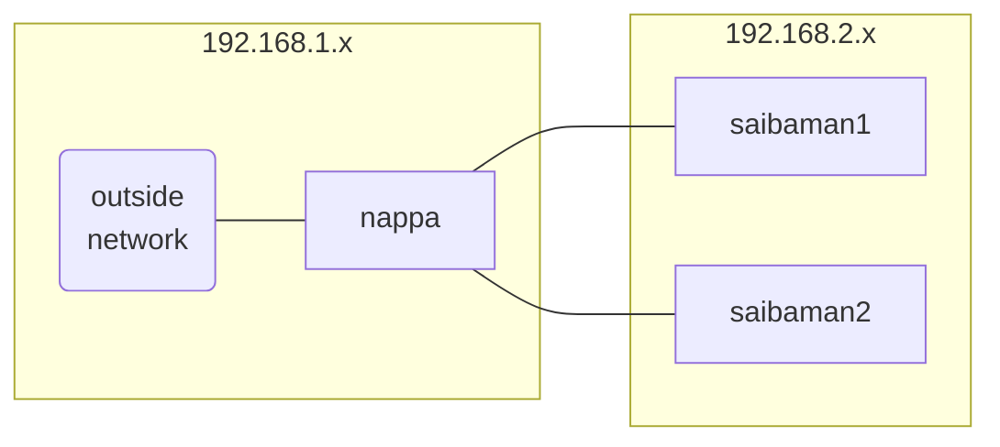

# Nappa

Configuration for the nappa k3s cluster.

## Overview

The cluster currently consists of three nodes:

* `nappa` - x86_64 NUC
* `saibaman1` - Raspberry Pi 4B (aarch64)
* `saibaman2` - Raspberry Pi 4B (aarch64)

`nappa` does all the heavy lifting here. It serves as network gateway (using dnsmasq), k3s control plane, and network storage (NFS share) for the cluster. Here's a little diagram to illustrate the network setup:



## Installation (nappa)

Install NixOS, then

1. Clone this repo to `/home/matt/nappa`

2. To `nixos-rebuild switch` to the new configuration, you can use `make`

    ```shell
    make nappa

    # or just...
    make
    ```

## Installation (saibamen)

The nix configurations at `nodes/saibamanX.nix` can be used to build sd card images.

1. Build the image

    ```shell
    make saibaman1

    # Or
    make saibaman2
    ```

2. Install the image on an SD card

    ```shell
     sudo dd if=./result/sd-image/nixos-sd-image-22.05.1700.365e1b3a859-aarch64-linux.img of=/dev/sdb bs=4096 conv=fsync status=progress
    ```

3. Put the SD card into the raspberry pi and start it up!

4. It'll take a moment for it to start up, but once it's up and running change the password

    ```shell
    # initial password is 'changeme'
    ssh matt@192.168.2.X
    passwd
    ```

5. The agent node should get picked up by the k3s server node automatically

### Bonus! How to mount the image without putting it on an SD card

1. The image has multiple partitions, use `losetup` to scan for them and add `/dev/loop*` devices:

    ```shell
    sudo losetup -Pf result/sd-image/nixos-sd-image-saibaman.img
    ```

2. Create a directory to mount to

    ```shell
    mkdir somewhere
    ```

3. Mount it!

    ```shell
    # /
    sudo mount /dev/loop2p2 somewhere

    # /boot
    sudo mount /dev/loop2p1 somewhere
    ```

### Making updates to already running saibamen

Saibamen nodes have their configurations copied to `/etc/nixos`. Either ssh in and make changes directly, or `scp` changes from nappa:

```shell
# Files in /etc/nixos have the same name as they do in this repo
# They're also writable by wheel users... that means matt!
scp nodes/saibaman_base.nix saibaman2:/etc/nixos/saibaman_base.nix
```

Before running `nixos-rebuild switch`, you'll need to update nix channels:

```shell
sudo nix-channel --update
```

And now you're good to go!

```shell
sudo nixos-rebuild switch
```
